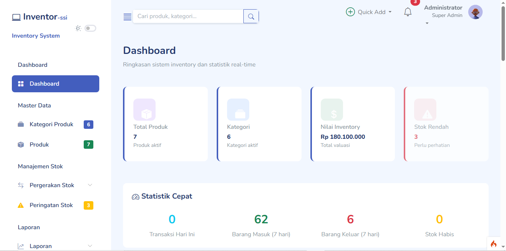
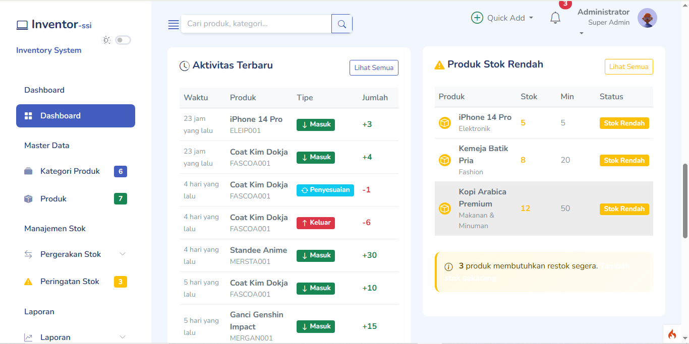
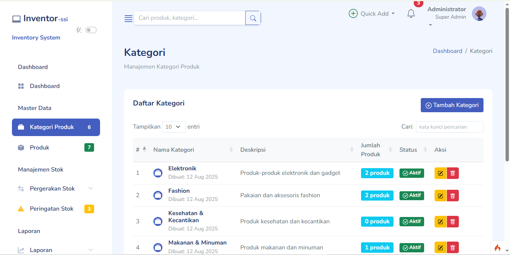

## 📦 Sistem Inventory dengan CodeIgniter 4


**Sistem Inventory** adalah aplikasi manajemen stok berbasis web yang dibangun dengan framework CodeIgniter 4 untuk membantu Anda mengelola produk, kategori, supplier, dan transaksi inventory dengan mudah.

---

### ✨ Fitur Utama
- **🏷️ Manajemen Produk & Kategori**

- 📊 **Laporan Stok Real-time**

- 🔄 **Sistem Transaksi Masuk/Keluar**

- 👥 **Manajemen Supplier**

- 🔐 **Sistem Autentikasi Pengguna**

- 📈 **Dashboard Analitik**

- 📱 **Responsive Design**

### 🚀 Persyaratan Sistem
- **PHP** versi `8.1` atau lebih tinggi.
- **Composer** untuk manajemen dependensi PHP.
- **Web Server** (Apache, Nginx, dll).
- **Database** (MySQL, PostgreSQL, dll).

> Pastikan ekstensi PHP berikut aktif:
> - `intl`
> - `mbstring`
> - `json`
> - `mysqlnd` *(jika menggunakan MySQL)*
> - `libcurl`

---

### 🛠️ Instalasi
Ikuti langkah-langkah berikut untuk menjalankan aplikasi di lokal:

### 1️⃣ Mengkloning Repositori
```bash
git clone https://github.com/USERNAME/aplikasi-presensi-ci4.git
cd aplikasi-presensi-ci4
```
### 2️⃣ Instalasi Dependensi
```bash
- composer install
```

### 3️⃣ Konfigurasi Lingkungan
```bash
buka file .env dan atur konfigurasi:

# APP
app.baseURL = 'http://localhost:8080'

# DATABASE
database.default.hostname = localhost
database.default.database = presensi_db
database.default.username = root
database.default.password =
database.default.DBDriver = MySQLi
```
### 4️⃣ Migrasi & Seeder Database
```bash
php spark migrate
php spark db:seed DatabaseSeeder
```

### 5️⃣ Menjalankan Server
```bash
php spark serve
```

### 📸 Screenshot
- **Tampilan Dashboard**



- **Tampilan Halaman Kategori**


